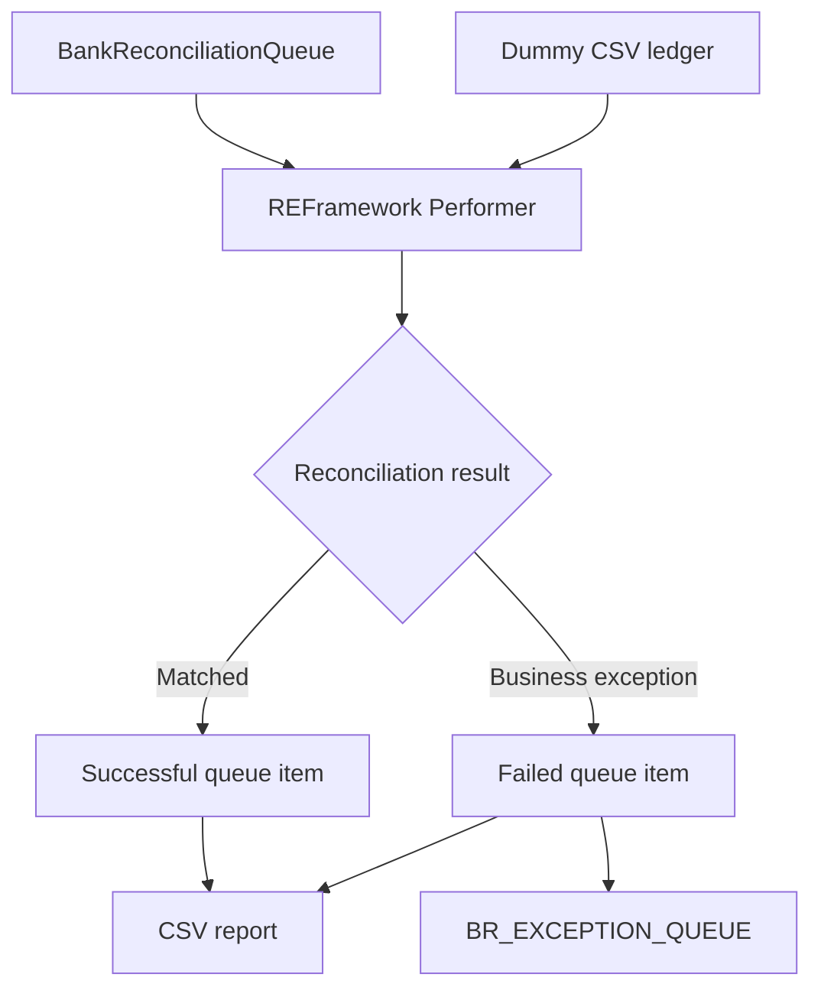

Portfolio project demonstrating input validation, queue-based automation, traceability, and a Dispatcher–Performer architecture.
```

**Performer repository — `README.md`**

```markdown
# Bank Reconciliation Performer

A UiPath REFramework automation that retrieves bank transactions from Orchestrator, reconciles them against a CSV ledger, writes reconciliation results, and routes business exceptions to a separate investigation queue.

**Companion repository:** [Bank Reconciliation Dispatcher](https://github.com/ishaq12web/uipath-bank-reconciliation)

## Project status

Working portfolio demonstration using synthetic data and a dummy CSV ledger.

Verified scenarios:

- A matching transaction completes successfully.
- A transaction without a ledger match raises a business exception.
- Both outcomes appear in the reconciliation CSV.
- The unmatched case is routed to the exception queue.

Production hardening and broader automated test coverage remain in progress.

## Business problem

Bank statement transactions need to be compared with ledger records, with differences recorded for investigation.

This automation separates successful matches from business exceptions and retains transaction identifiers, amounts, timestamps, and failure reasons in its output.

## Architecture



## Features

- REFramework transaction processing and exception handling.
- Configuration loaded from `Data/Config.xlsx`.
- Ledger loading through a separate workflow.
- Case-insensitive matching by transaction reference.
- Detection of missing and multiple ledger matches.
- Account and currency comparison.
- Debit and credit parsing and validation.
- Configurable amount and date tolerances.
- CSV reporting for matched and unmatched transactions.
- System-error reporting logic.
- Routing of business exceptions to an investigation queue.

## Reconciliation rules

A transaction passes only when:

1. Exactly one ledger row matches its transaction reference.
2. Account numbers match after trimming.
3. Currency codes match, ignoring case.
4. Debit and credit values have valid formats.
5. Each record has exactly one positive debit or credit.
6. Bank and ledger debit/credit directions agree.
7. Amount differences are within `AmountTolerance`.
8. Both transaction dates use `yyyy-MM-dd`.
9. The date difference is within `DateToleranceDays`.

The dummy ledger uses the same debit/credit direction convention as the bank input.

Matching selects candidates by reference first. Multiple rows with the same reference are treated as ambiguous.

`ValueDate` and `Description` are not currently matching criteria.

## Technology

- UiPath Studio Desktop
- UiPath REFramework
- C# expressions and LINQ
- UiPath Orchestrator queues
- CSV ledger and reconciliation report
- Excel configuration workbook

Activity dependencies are defined in `project.json`.

## Main workflows

| File | Responsibility |
|---|---|
| Main.xaml | REFramework orchestration and shared data |
| Framework/InitAllSettings.xaml | Configuration loading |
| LoadLedger.xaml | Read the dummy ledger |
| Framework/GetTransactionData.xaml | Retrieve a queue transaction |
| Framework/Process.xaml | Apply reconciliation rules and report matches |
| Framework/SetTransactionStatus.xaml | Update statuses, report failures, and route business exceptions |
| RequeueTestItem.xaml | Create synthetic matched and unmatched test items |

## Configuration

Review the Settings sheet in `Data/Config.xlsx`.

| Setting | Example value |
|---|---|
| OrchestratorQueueName | BankReconciliationQueue |
| ReconQueueName | BankReconciliationQueue |
| ExceptionQueueName | BR_EXCEPTION_QUEUE |
| LedgerFilePath | Data\Input\DummyLedger.csv |
| ReconciliationReportPath | Data\Output\ReconciliationReport.csv |
| AmountTolerance | 0 |
| DateToleranceDays | 2 |

Keep the existing REFramework Settings and Constants entries.

Queue activities must resolve to the folder containing the queues. The demonstrated setup uses a blank activity Folder Path to inherit the current execution folder. Review this when moving to another environment.

## Ledger format

The CSV ledger uses these columns:

`LedgerTxnId, AccountNumber, TransactionDate, ValueDate, TransactionReference, Description, Debit, Credit, Currency`

Keep account numbers as text and dates in `yyyy-MM-dd` format.

Quote CSV values containing commas, such as `"25,000"`.

The current demo includes ledger reference `TRF10008`, which can be used for a matched test.

## Setup and execution

1. Clone the repository and open `project.json` in UiPath Studio.
2. Restore dependencies.
3. Connect Studio and the Robot to Orchestrator.
4. Create these queues in the intended folder:
   - `BankReconciliationQueue`
   - `BR_EXCEPTION_QUEUE`
5. Update `Data/Config.xlsx` for your environment.
6. Verify `Data/Input/DummyLedger.csv` exists.
7. Create the `Data/Output` folder.
8. Populate the source queue through the Dispatcher or test helper.
9. Run `Main.xaml`.
10. Inspect the queue statuses, CSV report, and exception queue.

Run `RequeueTestItem.xaml` explicitly with Run File when creating test items. Running the project starts Main.

## Demonstrated test scenarios

| Scenario | Input | Expected and observed result |
|---|---|---|
| Match | Reference TRF10008 with matching account, amounts, currency, and date | Successful queue item and Matched report row |
| Missing ledger record | Reference TRF99999 | Business Exception, Unmatched report row, and investigation queue item |

The test helper generates timestamp-based bank transaction identifiers.

Additional tests are planned for duplicate ledger references, amount mismatch, currency mismatch, account mismatch, date tolerance boundaries, malformed data, and infrastructure failures.

## Reconciliation report

Default output:

`Data/Output/ReconciliationReport.csv`

Columns:

`BankTxnId, LedgerTxnId, TransactionReference, Status, Reason, BankDebit, BankCredit, LedgerDebit, LedgerCredit, Currency, ProcessedAt, RunId`

Current statuses:

- `Matched`
- `Unmatched`
- `SystemError`

Business-rule failures share the `Unmatched` status; `Reason` identifies the specific failure.

Matched amounts are normalized. Failure rows preserve original bank amount strings where available.

The report is accumulated in memory and written during processing. Each run starts with an empty table, and its first report write replaces the previous file. A run with no transactions leaves the existing file unchanged.

## Exception queue

Business exceptions are sent to `BR_EXCEPTION_QUEUE` with:

- OriginalBankTxnId
- TransactionReference
- FailureReason
- ExceptionType
- Debit
- Credit
- Currency
- RunId
- SourceQueue
- FailedAt

The exception reference combines the original reference with an exception timestamp.

This queue captures cases for investigation. Automatic case resolution and reprocessing are not implemented.

## Known limitations

- The ledger is a local CSV; API integration is planned.
- Reports are overwritten across runs and are not designed for concurrent robot writers.
- Queue status updates, CSV writes, and exception routing are separate operations rather than one atomic transaction.
- Timestamp-based exception references do not prevent duplicate investigation cases after reprocessing.
- System-error reporting and retry recovery require additional end-to-end testing.
- The template ProcessTestCase requires updated argument mappings and proper test fixtures; analyzer warning SY-USG-015 is pending.
- Successful matching does not mark a ledger row as consumed, so another bank item with the same reference can match it again.
- Performance has not been benchmarked at production volumes.

## Repository contents

Keep workflows, project configuration, and synthetic test inputs under version control.

Exclude generated runtime reports, logs, screenshots, local caches, and temporary Excel lock files.

A curated synthetic report can be stored separately under `docs/samples/` as demonstration evidence.

## Planned improvements

- Preserve reports by run and support safe recovery.
- Prevent duplicate ledger consumption and duplicate exception cases.
- Add automated tests and resolve the template analyzer warning.
- Validate ledger schema during initialization.
- Replace the dummy ledger with an API integration.
- Add operational metrics and a documented deployment procedure.

## Author

Ishaku Danladi

Portfolio project demonstrating REFramework, Orchestrator queues, configurable reconciliation rules, exception handling, and reporting.
```
